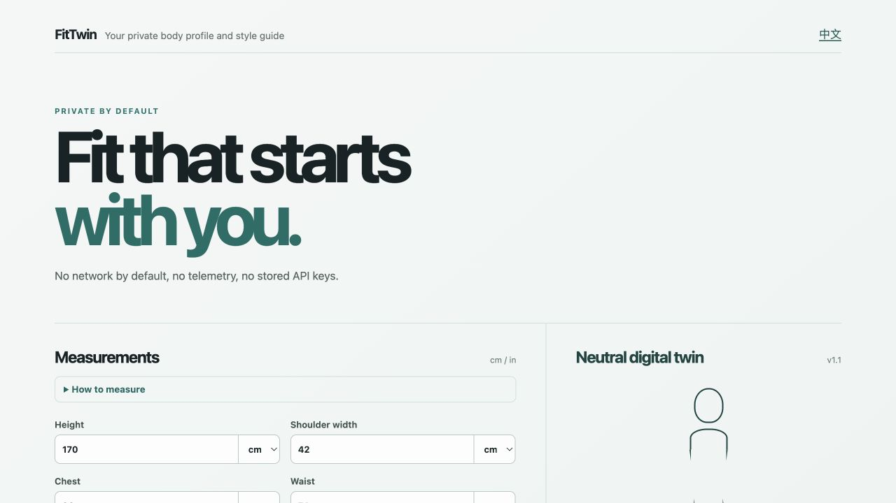

# FitTwin

FitTwin is an open-source, local-first body profile and style-guide toolkit. Individuals can build a private measurement-based digital twin in a PWA; studios and brands can use the same TypeScript SDK for transparent top and bottom size matching.

> Alpha software: FitTwin offers styling options, not medical advice, an identity classification, a body scan, or a guarantee of fit.

[Open the live demo](https://j1374483500-dot.github.io/fittwin/) · [Changelog](CHANGELOG.md)



*Actual demo interface; the displayed measurements are built-in example values.*

## What is included

- Manual body measurements with centimetre and inch input, stored locally in the browser.
- A neutral, data-derived 2D silhouette—no photograph, scan, gender inference, telemetry, or account.
- A consent-gated AI guide via the user's own loopback-only companion and OpenAI-compatible provider.
- Transparent garment sizing for standard top and bottom size charts.
- A personal, browser-local size-check form: enter a brand's measurements, save the chart on your device, and see the recommended size with per-area differences.
- A local MCP server with four read-only tools by default and an optional consented feedback-write tool, so compatible AI clients can call FitTwin capabilities without turning the profile into a cloud API.
- TypeScript SDK, React silhouette component, personal PWA, and a local AI companion.

## Quick start

```bash
corepack enable
pnpm install
pnpm build
pnpm dev:web
```

Open the displayed local URL. Profiles and feedback are retained only in that browser's IndexedDB. Use **Export profile** before changing browsers or devices.

The [live demo](https://j1374483500-dot.github.io/fittwin/) is deployed to GitHub Pages after every successful `main` build. It works without any model key: create a profile, generate an offline base guide, and build a local wardrobe first. The companion is only required for a provider-generated guide.

### Check a garment size table

In the personal app, open **Personal size check**, enter the garment name and its top or bottom size-table values, then choose **Save and check fit**. FitTwin saves that table only in this browser and explains the closest size with shoulder/chest or waist/hip/inseam differences. It does not scrape product pages and it does not guarantee a garment will fit; use it as a transparent starting point alongside the brand's own guidance.

### Connect an AI client locally

FitTwin is agent-native: the web app is a private profile editor, while `@fittwin/mcp` is a local capability provider for compatible AI clients. Export an encrypted **AI vault** from the PWA, then configure your client to launch `fittwin-mcp` over stdio. It exposes four read-only tools by default: a minimized profile summary, outfit recommendation from the exported wardrobe, garment-fit assessment, and an offline style brief. Explicitly setting `FITTWIN_ALLOW_WRITES=true` enables one additional tool to record style feedback in the encrypted local vault; importing that vault back into the PWA is a separate user action. The server has no network endpoint and does not call a model provider.

See [the MCP setup guide](docs/mcp.md) before connecting a client. A connected client can see the result of any tool it invokes; only connect a client you trust.

### Enable AI guidance locally

FitTwin never puts a model key in the PWA. Run the companion on the same device instead:

```bash
export FITTWIN_API_KEY='your-key'
export FITTWIN_BASE_URL='https://your-openai-compatible-endpoint/v1'
export FITTWIN_MODEL='your-model'
pnpm dev:companion
```

Copy the pairing token printed by the companion into the PWA. The companion listens only on `127.0.0.1`; it sends a minimized measurement/proportion and preference summary only after the in-app consent checkbox is selected. For a deployed PWA, set `FITTWIN_ORIGIN` to its exact HTTPS origin.

## SDK

```ts
import { createFitTwin } from "@fittwin/sdk";

const fitTwin = createFitTwin(); // memory-only by default
const profile = await fitTwin.createProfile({
  id: "visitor-42",
  measurements: {
    height: { value: 175 }, shoulder: { value: 44 }, chest: { value: 96 },
    waist: { value: 78 }, hip: { value: 98 }, inseam: { value: 80 }
  },
  preferences: { goals: ["classic"], occasions: ["work"], avoid: [] }
});

const assessment = await fitTwin.assessGarmentFit(profile.id, {
  id: "oxford-shirt", name: "Oxford shirt", category: "top", fitIntent: "regular",
  sizes: [{ label: "M", measurements: { shoulder: 44, chest: 108 } }]
});
```

See [the data format](docs/data-format.md), [privacy design](docs/privacy.md), and [AI companion guide](docs/ai-companion.md).

## Development

```bash
pnpm typecheck
pnpm test
pnpm build
```

The current source version is `0.1.0-alpha.2`. See [GitHub prereleases](https://github.com/j1374483500-dot/fittwin/releases) and the [changelog](CHANGELOG.md) for release history, changes, and remaining limitations. GitHub releases and npm publication are separate: use the source checkout above; npm publication remains opt-in and requires the `@fittwin` scope and release credentials.

## License

[MIT](LICENSE)
